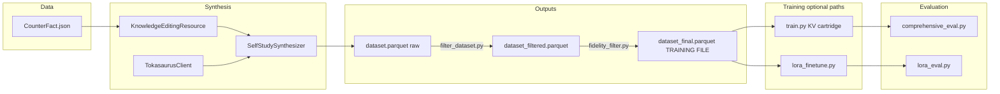

# Knowledge editing and Self-Study: project reference

This document is the canonical overview for using **Self-Study** (from the cartridges codebase) to build **large synthetic dialogue datasets** grounded in **CounterFact / AKEW-style** facts, then **LoRA-fine-tune** models such as Qwen and evaluate against baselines (for example AnyEdit) with **AKEW-aligned** metrics.

The original cartridges research focuses on **trainable KV caches** (“cartridges”). In this fork, the cartridge itself is often secondary; the priority is **Self-Study synthesis** as a data engine, **parquet** export, and downstream **LoRA** training plus evaluation.

---

## Repository map

| Area | Path | Role |
|------|------|------|
| Core library | [`cartridges/cartridges/`](../cartridges/) | Synthesizers, data resources, clients, training/synthesize orchestration |
| Inference server | [`tokasaurus/`](../tokasaurus/) | Tokasaurus HTTP API for batched chat completions (used during synthesis) |
| Knowledge-editing example | [`knowledge-editing/`](../knowledge-editing/) | Configs and scripts: synthesize, LoRA train/eval, comprehensive eval, samples |

---

## End-to-end pipeline

1. **Data**: JSON list in CounterFact shape (see [CounterFact fields](#counterfact-json-synthesis-vs-evaluation)).
2. **Synthesis**: [`KnowledgeEditingResource`](../cartridges/data/resources.py) loads facts and emits one shared **context** plus per-row **seed prompts** and **seed types**. [`SelfStudySynthesizer`](../cartridges/synthesizers/self_study.py) calls the **Tokasaurus** backend via [`TokasaurusClient`](../cartridges/clients/tokasaurus.py) to generate two-turn dialogs (user from Bot A, assistant from Bot B).
3. **Output**: [`SynthesizeConfig`](../cartridges/synthesize.py) aggregates [`Conversation`](../cartridges/structs.py) objects and writes **parquet** (messages, metadata, optional top logprobs).
3b. **Data cleaning (two stages, added 2026-07-15; never train on the raw parquet)**: [`filter_dataset.py`](../knowledge-editing/filter_dataset.py) repairs think-blocks and drops context-meta / portability-leak rows → `dataset_filtered.parquet`; then [`fidelity_filter.py`](../knowledge-editing/fidelity_filter.py) runs the LLM judge and drops targets that assert the pre-edit fact → **`dataset_final.parquet`, which is the file training reads**.
4. **Training (primary path for your paper)**: [`lora_finetune.py`](../knowledge-editing/lora_finetune.py) reads `dataset_final.parquet` and runs **PEFT LoRA** on a base Qwen model, with **assistant-only loss masking** and dynamic padding (added 2026-07-26; the prompt span is masked to `-100`).
5. **Training (cartridge / KV path, deprioritized)**: [`legacy/train.py`](../knowledge-editing/legacy/train.py) can train a **cartridge** from parquet using [`TrainConfig`](../cartridges/train.py) and KV initializers; this parallels the original paper but is optional for LoRA-only comparisons.
6. **Evaluation**: [`lora_eval.py`](../knowledge-editing/lora_eval.py) (local LoRA, primary) and [`legacy/comprehensive_eval.py`](../knowledge-editing/legacy/comprehensive_eval.py) (HTTP-served cartridge, deprioritized) implement multi-metric, AKEW-style splits.

---

## Tokasaurus (inference engine)

- **Location**: [`tokasaurus/`](../tokasaurus/) — FastAPI server (see [`tokasaurus/server/endpoints.py`](../tokasaurus/tokasaurus/server/endpoints.py)).
- **Client**: [`cartridges/clients/tokasaurus.py`](../cartridges/clients/tokasaurus.py) posts to endpoints such as **`/custom/synchronous-batch-completions`** for batch generation used by Self-Study.
- **Cartridges on the server**: Optional routes inject **precomputed KV** (“cartridge”) into generation. **Self-Study dataset generation** typically uses **plain batch chat** without cartridges unless you configure `cartridges` on the client.
- **Contract**: At startup, the client can verify that the server’s `/v1/models` matches `model_name` in config.

---

## Orchestration: `synthesize.py`

[`cartridges/synthesize.py`](../cartridges/synthesize.py) defines `SynthesizeConfig`:

- **`synthesizer`**: Usually [`SelfStudySynthesizer.Config`](../cartridges/synthesizers/self_study.py).
- **`num_samples`**: Total conversations to generate.
- **`batch_size`**: Conversations that share the same **context** (prefix sharing on the server).
- **`max_num_batches_in_parallel`**: Worker parallelism; tune with GPU capacity (comments in config suggest rough totals on the order of 128–256 concurrent conversations per GPU, depending on setup).

Outputs land under `CARTRIDGES_OUTPUT_DIR` (or `output_dir`) in a timestamped run folder containing **`artifact/dataset.parquet`**.

---

## `KnowledgeEditingResource` ([`resources.py`](../cartridges/data/resources.py))

### Purpose

Loads a **JSON array** of CounterFact-style records. For each top-level object with `requested_rewrite`, it stores a flattened **edit**:

- `subject`, `old_target` (from `target_true.str`), `new_target` (from `target_new.str`)
- `fact_new`, `fact_new_uns`, `relation_id`, `prompt` (relation template, often with `{}` for subject)

### `sample_prompt(batch_size)`

- Draws **one random edit** for the entire batch (all rows in the batch condition on the **same** fact).
- Samples **`batch_size`** seed **types** with replacement from `config.seed_prompts` (e.g. `negation`, `correction`, `question`).
- Returns **`(context, seed_prompts, seed_types)`**.

The base [`Resource`](../cartridges/data/resources.py) abstract method is documented as returning `(context, seed_prompts)` only; **`KnowledgeEditingResource` extends this contract** with **`seed_types`** so the synthesizer can pick **per-sample system prompts**.

### Context string (`_build_clean_context`)

- If `fact_new_uns` is non-empty, use it (richer unsupervised-style paragraph).
- Otherwise use `fact_new` (short QA-style fact line).

### Relation phrase (`extract_relation_phrase`)

Heuristic extraction of a **relation label** (e.g. “twin city”, “capital”) from the `prompt` template. Seed generators use this to phrase user **intents** consistently across types.

### Seed types and `SEED_PROMPT_REGISTRY`

Registered generators produce **English instructions for Bot A** (“generate a user message that …”), not the final user utterance. They are keyed by string names such as:

| Seed type | Typical role | In the active mix? |
|-----------|----------------|--------------------|
| `question` | Ask for the **new** fact directly | **yes — weight 20** |
| `negation` | Assert or ask about the **old** fact (assistant denies per `NEGATION_SYSTEM_PROMPT`) | **yes — weight 15** |
| `correction` | User insists on **old** fact; assistant aligns with **new** | **yes — weight 15** |
| `reciprocal` | Probe the edit in the **reverse** direction (from the new target back to the subject) | **yes — weight 20** |
| `portability` | Multi-hop: compose the edit with a background fact about the new target (DCT-style, two-stage prompt) | **yes — weight 30** |
| `derivative` | Follow-up questions about **new_target** and relation | no — scrapped as redundant |
| `creative` | `creative_ripple_seed_prompt` — "ripple" / invalidated assumptions | no — scrapped, fidelity-risky |
| `ignorance` | User asks about **old** association; paired with refusal-style prompts | no — scrapped (refusal) |
| `strict` | Requests that must be refused **without** naming context entities | no — scrapped (refusal) |

The **active mix is set in [`synthesize.py`](../knowledge-editing/synthesize.py)**:
`seed_prompts=["question","negation","correction","reciprocal","portability"]` with
`seed_weights=[20,15,15,20,30]` (relative; `random.choices` normalises). The scrapped
generators are still registered in `SEED_PROMPT_REGISTRY` but are not sampled — see
the enrichment rationale in [`CHANGELOG.md`](CHANGELOG.md).

Legacy/generic types (`structuring`, `summarization`, `use_case`, `generic`) remain for other resources; the knowledge-editing path primarily uses the table above.

---

## `SelfStudySynthesizer` ([`self_study.py`](../cartridges/synthesizers/self_study.py))

### System prompts

Several templates embed `{subcorpus}` (the **context** from the resource). They are tuned to:

- Reduce **meta-phrasing** (“according to the context”).
- Encourage **linguistic diversity** across samples.

Important templates include:

- **`QUESTION_SYSTEM_PROMPT`**: Factual Q&A as if knowledge were internal.
- **`NEGATION_SYSTEM_PROMPT`**: Deny statements that contradict `<info>` or are unsupported.
- **`CREATIVE_SYSTEM_PROMPT`**: Explain **ripple effects** of an update (aligned with `creative` / ripple seeds).
- **`REFUSAL_SYSTEM_PROMPT`**, **`STRICT_REFUSAL_SYSTEM_PROMPT`**: Refuse without leaking entities (for `ignorance` / `strict`).

### `SYSTEM_PROMPTS_BY_SEED`

Maps **seed type** → system template. Examples:

- `question`, `derivative`, `paraphrase`, `correction` → question-style assistant.
- `negation` → negation guardian.
- `creative` → creative / ripple assistant.
- `ignorance` → refusal; `strict` → strict refusal.

### Conversation loop (`sample_convos`)

1. **Prompt sampling**: `ctx, seed_prompts, seed_types = await resource.sample_prompt(batch_size)`.
2. **Per-row system prompt**: `SYSTEM_PROMPTS_BY_SEED[seed_type].format(subcorpus=ctx)`.
3. **Metadata**: `seed_prompt`, `seed_type`, `is_refusal` (true for `ignorance` and `strict`).
4. **Bot A** (user message): High temperature (~0.95). System = context + persona + instruction to turn **“Intent: {seed}”** into a **natural user message** only.
5. **Bot B** (assistant): Lower `temperature_b`, optional **top logprobs** for distillation-style targets, optional **thinking** with probability `prob_thinking`. Input is `system(ctx)` + the conversation **without** role flip (actual chat order).
6. **Export**: [`_responses_and_chats_to_training_examples`](../cartridges/synthesizers/self_study.py) builds [`Conversation`](../cartridges/structs.py) with messages, token ids, optional flattened logprobs, **`metadata`**, and **`system_prompt`** stored on the conversation.

Optional **tool** branches (`use_tools_a`, `use_tools_b`) exist for the generic pipeline; the knowledge-editing [`synthesize.py`](../knowledge-editing/synthesize.py) typically sets `tools=[]`.

---

## `knowledge-editing/` scripts

*Layout restructured 2026-07-15: the LoRA path is primary; the cartridge/KV path and superseded scripts moved to `legacy/`.*

| File | Purpose |
|------|---------|
| [`README.md`](../knowledge-editing/README.md) | Concise pipeline overview, commands, and file map (replaces the former `SUMMARY.md` / `MULTI_SAMPLE_EVAL.md`). |
| [`synthesize.py`](../knowledge-editing/synthesize.py) | Dataset generation: `SynthesizeConfig` + `SelfStudySynthesizer` + `KnowledgeEditingResource` + `TokasaurusClient`. Set `CARTRIDGES_DIR`, path to [`samples/CounterFact.json`](../knowledge-editing/samples/CounterFact.json), `seed_prompts`, `num_samples`, batch settings. |
| [`lora_finetune.py`](../knowledge-editing/lora_finetune.py) | Load parquet via `read_conversations`, apply tokenizer chat template, train **LoRA** (PEFT). |
| [`lora_eval.py`](../knowledge-editing/lora_eval.py) | **Primary eval**: multi-reference ROUGE/BERT, EM, old-target leakage, LLM judge, AKEW-style splits, for a **locally loaded** LoRA (default judge: vLLM server on port 10310). |
| [`eval_common.py`](../knowledge-editing/eval_common.py) | Shared helpers: thinking stripping (incl. Qwen3 `<think>`), results paths, **`ask_judge_http`** with xgrammar-constrained JSON on vLLM, `judge_failed` semantics, `judge_aggregates`. |
| [`judge_smoke_test.py`](../knowledge-editing/judge_smoke_test.py) | Judge reliability + calibration check; must PASS before full evals. |
| [`filter_dataset.py`](../knowledge-editing/filter_dataset.py) | **Cleaning stage 1**: think-block repair, context-meta and portability-leak drops → `dataset_filtered.parquet` + a report JSON. |
| [`fidelity_filter.py`](../knowledge-editing/fidelity_filter.py) | **Cleaning stage 2**: LLM judge drops targets asserting the pre-edit fact → `dataset_final.parquet`. Report carries `per_seed` and `per_seed_case` (per-edit) breakdowns. |
| [`analyze_portability_hops.py`](../knowledge-editing/analyze_portability_hops.py) | Portability hop-diversity gate: hop buckets, background-fact coverage, target leaks, duplicates, fact-anchor spread. |
| [`grom_erase.py`](../knowledge-editing/grom_erase.py) | GROM closed-form erase of pre-edit facts from the teacher **or** the student. `--dry-run` (CPU audit), `--attribution K` (layer band), `--dump-forget-subset`, `--no-save`, `--solve-device`. |
| [`compare_fidelity.py`](../knowledge-editing/compare_fidelity.py) | A/B readout of two synthesis runs: per-seed `asserts_old` rates with an **edit-clustered** CI. |
| [`summarize_grom_sweep.py`](../knowledge-editing/summarize_grom_sweep.py) | Collapses a GROM sweep into one promotion table (suppression / collateral / fluency). |
| `slurm/*.sbatch` | `synth_clean` (tksrs + synthesize + filter), `fidelity_filter`, `lora_train_clean`, `eval`, `grom_erase`, `grom_sweep`, `grom_sweep_student`, `serve_judge_vllm`. Env overrides are documented in each file's header and in the [KE README](../knowledge-editing/README.md). |
| [`slurm/serve_judge_vllm.sbatch`](../knowledge-editing/slurm/serve_judge_vllm.sbatch) | Standalone vLLM judge server (port 10310); logs in `slurm/logs/`. |
| [`samples/dev_small.json`](../knowledge-editing/samples/dev_small.json) | 4-fact dev set (merged former `test{,2,3,4}.json`). |
| [`legacy/comprehensive_eval.py`](../knowledge-editing/legacy/comprehensive_eval.py) | Cartridge/KV-path eval over HTTP (deprioritized). |
| [`legacy/train.py`](../knowledge-editing/legacy/train.py) | **Cartridge / KV** training from parquet (deprioritized). |
| [`legacy/`](../knowledge-editing/legacy/) | Also: `toka-serving.py`, `lora_serving.py`, `llm_judge_eval.py` (superseded), `contexts/`. |

---

## CounterFact JSON: synthesis vs evaluation

### Used by synthesis (`KnowledgeEditingResource`)

- **`requested_rewrite`**: especially `subject`, `target_true.str`, `target_new.str`, `prompt`, `fact_new`, `fact_new_uns`, `relation_id`.

### Used by evaluation scripts

- Same rewrite fields, plus top-level **AKEW-style** arrays when present:
  - **`prompt_full`**, **`paraphrase_prompts`**, **`neighborhood_prompts`**, **`attribute_prompts`**, **`generation_prompts`**

For metric definitions and evaluation tips, see [`knowledge-editing/README.md`](../knowledge-editing/README.md).

---

## Operational checklist

Everything below runs through Slurm in practice; the sbatch wrappers and their env
overrides are listed in the [KE README](../knowledge-editing/README.md). Two rules that
break jobs when forgotten: **never pass `--mem`** (nodes report `RealMemory=1`, any
request fails) and **always pin `--gres=gpu:rtx5090:N`** for anything touching
flashinfer/vLLM/tksrs — the venv's flashinfer is built for sm120 and the workers crash
on the rtx4090 node with a misleading multiprocessing traceback.

1. **Environment**
   - Set **`CARTRIDGES_DIR`** to the **cartridges repo root** (the parent of the
     `cartridges/` package and of `knowledge-editing/`; the KE project moved out of
     `examples/` to the repo root on 2026-07-15).
   - Set **`CARTRIDGES_OUTPUT_DIR`** (or rely on `output_dir` in config) for synthesis
     outputs.

2. **Start Tokasaurus** on the host/port expected by [`TokasaurusClient`](../knowledge-editing/synthesize.py) (default `http://localhost:10210`). Ensure the served **model id** matches `model_name` in the client config — `slurm/synth_clean.sbatch` keeps them in sync via `TEACHER_MODEL`, and a mismatch is not merely cosmetic (see the thinking-mode failure recorded in [`CHANGELOG.md`](CHANGELOG.md)).

3. **Generate data**
   - Run [`synthesize.py`](../knowledge-editing/synthesize.py), or the whole
     synthesize + filter chain via `slurm/synth_clean.sbatch`.
   - Then run **both cleaning stages**: `filter_dataset.py` → `dataset_filtered.parquet`,
     then `fidelity_filter.py` (needs the vLLM judge) → **`dataset_final.parquet`**.
   - Collect **`artifact/dataset_final.parquet`** — *not* `dataset.parquet` and *not*
     `dataset_filtered.parquet`.

4. **Train**
   - **LoRA**: [`lora_finetune.py`](../knowledge-editing/lora_finetune.py) with
     `--parquet-path` pointing at `dataset_final.parquet`, or
     `slurm/lora_train_clean.sbatch` with `DATA_FILE=` (required) and `BASE_MODEL=`
     when starting from a non-stock base.
   - **Cartridge (optional, deprioritized)**: adjust paths in [`legacy/train.py`](../knowledge-editing/legacy/train.py) and run.

5. **Evaluate**
   - **LoRA locally**: [`lora_eval.py`](../knowledge-editing/lora_eval.py) with
     `--data-file` pointing at a JSON sample list, or `slurm/eval.sbatch` (judge +
     student in one 2-GPU job). If the adapter was trained on an edited base, pass the
     **same** `BASE_MODEL` — otherwise it silently loads on the wrong weights.
   - **HTTP / cartridge (deprioritized)**: [`legacy/comprehensive_eval.py`](../knowledge-editing/legacy/comprehensive_eval.py).

6. **Comparisons** (e.g. AnyEdit): use the **same** JSON test files and the same eval
   scripts so metrics are comparable. Pass `--seed 82` (the default) so the sampled
   locality/portability questions are identical across checkpoints.

---

## Evaluation caveats (LLM judge and thinking blocks)

- **`comprehensive_eval.py`**: Model answers come from **`/custom/cartridge/chat/completions`** (cartridge-conditioned). The **LLM judge** uses **`/v1/chat/completions`** on a configurable **`--judge-base-url`** (default: same as **`--base-url`**) and **`--judge-model`**. The judge is **not** the cartridge KV cache, but if URL and model match the same backbone as your edited model, scores can still be **correlated**. For stronger claims, point **`--judge-base-url` / `--judge-model`** at a **separate** API or frozen baseline model.

- **`lora_eval.py`**: Answers are generated with the **evaluated LoRA** weights. The **default** judge is **HTTP** (`ask_judge_http` in [`eval_common.py`](../knowledge-editing/eval_common.py)), same protocol as comprehensive eval, via **`--judge-base-url`** (CLI default **`http://localhost:10310`**, the vLLM judge from `slurm/serve_judge_vllm.sbatch`; note some in-file *function* signatures still default to 10210 — the CLI is what runs) and **`--judge-model`** (default `Qwen/Qwen3-4b`). Using **`--judge-with-evaluated-model`** runs the **same LoRA** as judge (circular, can bias scores); that path is for **ablations only**.

- **Thinking / reasoning tags**: [`strip_thinking_artifacts`](../knowledge-editing/eval_common.py) removes common tags (Qwen-style `redacted_thinking` blocks, `thinking`, `reasoning`, `analysis`). Models may emit other formats; stripping is **best-effort**. If judge JSON parsing fails often, use **`--no-judge`** for metric-only runs or fix the judge endpoint / prompts.

- **Default result paths**: Unless **`--output`** is set, both scripts write under **[`<repo>/results/`](../results/)** into a **timestamped run folder**:
  - Cartridge eval: `cartridge-YYYYMMDD_HHMMSS/eval.json`, `eval_summary.csv`, `eval_detailed.csv`, etc.
  - LoRA eval: `lora-YYYYMMDD_HHMMSS/eval.*`
  - **`--output`** can be an absolute path or a path relative to the **current working directory** (legacy behavior).

---

## Shared cluster and execution policy (Slurm, manual runs)

This project runs on a **shared cluster** with **Slurm**; the login node has no GPU.

**Policy (set by Iraj 2026-07-15, supersedes the stricter wording this section used to
carry):** an assistant **may** submit Slurm jobs (`sbatch`/`srun`/`scancel`) but **must
ask before each submission** — approval for one job does not carry to the next.
Login-node-only work (downloads, venv setup, CPU scripts, dry-runs, HTTP smoke tests)
needs no per-action approval. Long jobs are watched by Iraj, who reports back; do not
poll them.

- Python env: repo-local `.venv` (Python 3.12) managed with **uv** — install with
  `uv pip install`, never plain `pip` inside the venv. The vLLM judge has its own
  `.venv-vllm`.
- All job logs are plain `slurm/logs/%j.log` (no name prefix).

- Before **`comprehensive_eval.py`** or **`lora_eval.py`**, ensure **Tokasaurus** (or whatever serves **`/v1/chat/completions`** for the judge) is reachable from the node where you run the script—often the same allocation as the eval client, or a host/port exposed per cluster policy.

- Smoke tests and **`--help`** checks are **optional** and **manual** when you choose to run them; nothing in this repo requires unattended eval runs as a merge gate.

---

## Related documentation

- [`docs/CHANGELOG.md`](CHANGELOG.md) — **dated engineering log, newest first: what changed, when, and what it measured. Start here when resuming.**
- [`docs/project-progress-2026.md`](project-progress-2026.md) — narrative progress log with the full result tables.
- [`docs/README.md`](README.md) — index of docs in this folder.
- [`knowledge-editing/README.md`](../knowledge-editing/README.md) — pipeline overview, commands, and file map.
- [`docs/training.md`](training.md) — training worklist / agent notes.

---

## Implementation note (tools in Self-Study)

If you re-enable **`use_tools_a`** or **`use_tools_b`**, review tool result list initialization in [`self_study.py`](../cartridges/synthesizers/self_study.py) (`_get_content_via_tool`): avoid shared mutable default list bugs when batching tool outputs.
